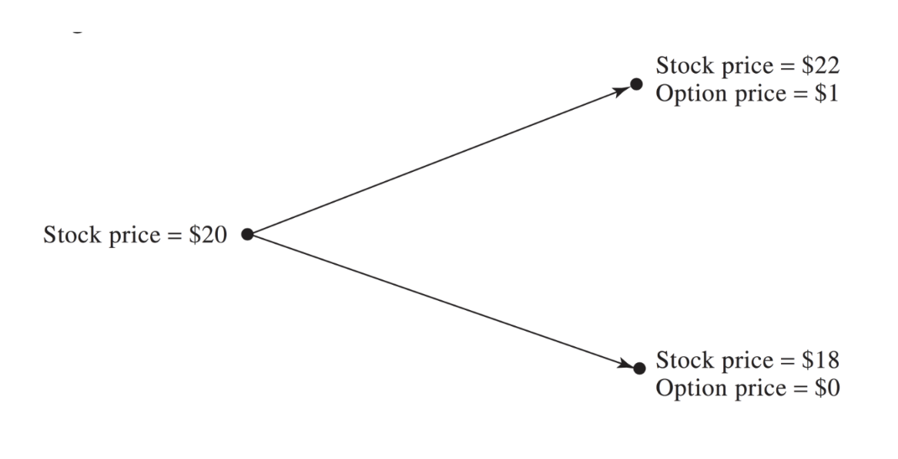
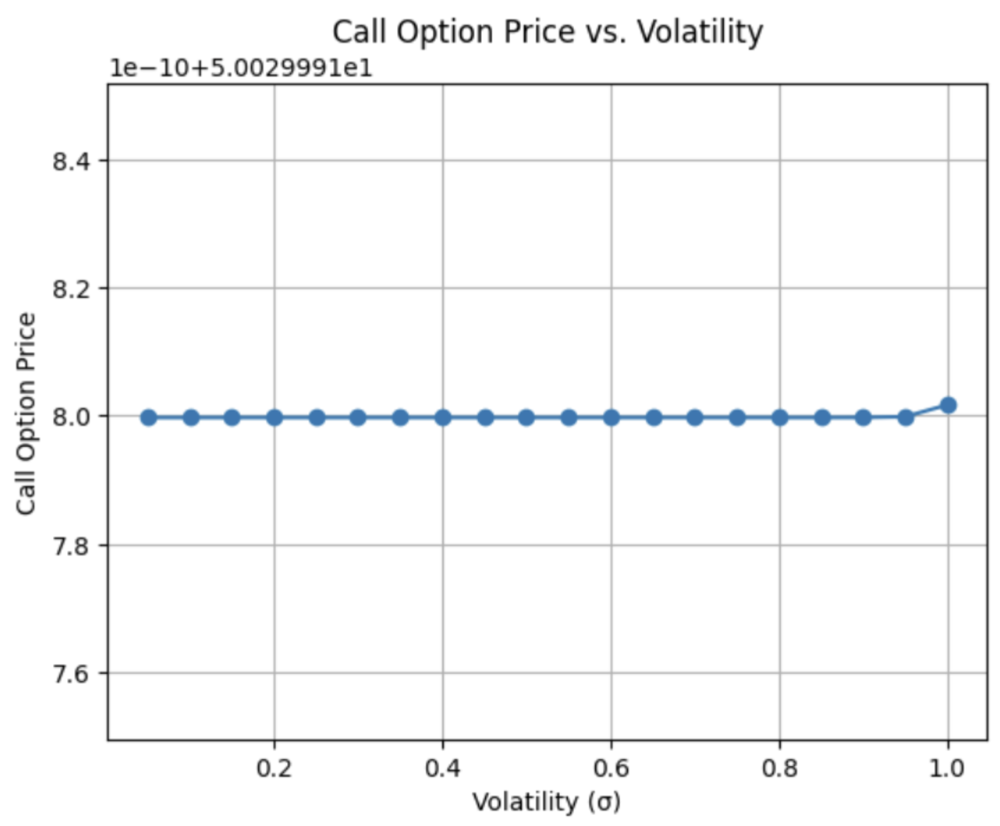

# Portfolio of Financial Derivatives & Options

A worked portfolio of **115+ exercises** in mathematical finance — from forward-contract
payoffs through risk-neutral binomial pricing, a from-scratch derivation of the
Black–Scholes formula, volatility estimation, and linear programming.

Written in LaTeX with every solution shown in full: derivations, arbitrage arguments,
TikZ/pgfplots payoff diagrams, and numerical results.

📄 **[Read the full portfolio (74 pages, PDF)](MATH_476_Portfolio.pdf)**

---

## What's inside

| Topic | Exercises | Highlights |
|---|---|---|
| **Forwards & futures** | 1–20 | Long/short payoff diagrams, FX hedging with bid–ask spreads, margin and settlement |
| **Options fundamentals** | 21–40 | Call/put payoffs vs. profits, leverage comparisons, writing options, time value of money under discrete and continuous compounding |
| **No-arbitrage bounds** | 41–55 | Upper and lower bounds on option prices, put–call parity, early exercise of American puts, convexity in strike |
| **Trading strategies** | 48–56, 81 | Bull and bear spreads, butterflies, straddles, strangles — profit tables and expiry diagrams |
| **Binomial tree pricing** | 56–80 | Delta-hedged riskless portfolios, risk-neutral probability $p = \frac{e^{rT}-d}{u-d}$, one- and two-step trees, backward induction |
| **Black–Scholes from the binomial limit** | BSM 1–4 | Deriving $c = e^{-rT}(S_0U_1 - KU_2)$ and taking $n \to \infty$ to recover $c = S_0N(d_1) - Ke^{-rT}N(d_2)$ |
| **Volatility** | Vol 1–4 | Historical volatility from weekly and daily closes, implied volatility by numerical inversion, sensitivity of call price to $\sigma$ |
| **Linear programming** | 98–115 | Feasible-region graphing, conversion to standard form, the simplex method, and applied optimization problems |

### A few results worth skimming

- **Risk-neutral pricing from first principles** (Ex. 63–70) — construct the
  $\Delta$-hedged portfolio, show it is riskless regardless of the stock's move, and
  derive $f = e^{-rT}[pf_u + (1-p)f_d]$ before extending it to the two-step case.
- **Black–Scholes as a limit** (BSM Problems 1–4) — show the binomial summation's terms
  are nonzero exactly when $j > \frac{n}{2} - \frac{\ln(S_0/K)}{2\sigma\sqrt{T/n}}$, then
  prove $p(1-p) \to \tfrac14$ and apply the central limit theorem.
- **Volatility estimation** (Vol 1–3) — annualized $\sigma \approx 0.208$ from 15 weekly
  closes; implied $\sigma \approx 0.396$ backed out of a \$2.50 call; $\sigma \approx 0.098$
  from a month of DASH daily closes.

<p align="center">
  
  
</p>

---

## Repository layout

```
.
├── MATH_476_Portfolio.pdf   # compiled portfolio — start here
├── src/
│   ├── main.tex             # the portfolio source (~4,600 lines)
│   ├── course-notes.tex     # course notes / problem statements (reference)
│   └── figures/             # diagrams, plots, and computed output
└── LICENSE
```

## Building the PDF

Requires a TeX distribution with `pgfplots` and `tikz` (TeX Live, MacTeX, or MiKTeX).

```bash
cd src
pdflatex main.tex && pdflatex main.tex   # run twice to resolve references
```

The second pass is needed for cross-references and hyperlinks. `main.tex` sets
`\graphicspath{{figures/}{./}}`, so it must be compiled from inside `src/`.

> `course-notes.tex` is the instructor's source for the problem statements, kept for
> reference. It will not compile as-is — several of its figures were not distributed
> with the original materials.

## Numerical work

The volatility exercises were computed in Python (historical volatility, Black–Scholes
pricing, and implied volatility by numerical root-finding). The notebook is linked from
the Volatility Exercises section of the PDF.

---

## About

Coursework for **MATH 476 — Mathematical Finance**, Cal Poly San Luis Obispo.
Written by **Andres Rocha**.

Solutions are released under [CC BY 4.0](LICENSE). Problem statements belong to the
course instructor and are reproduced here only to make the solutions readable.
